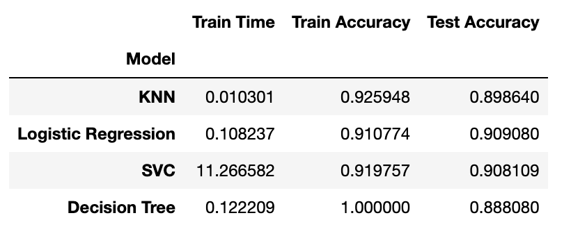
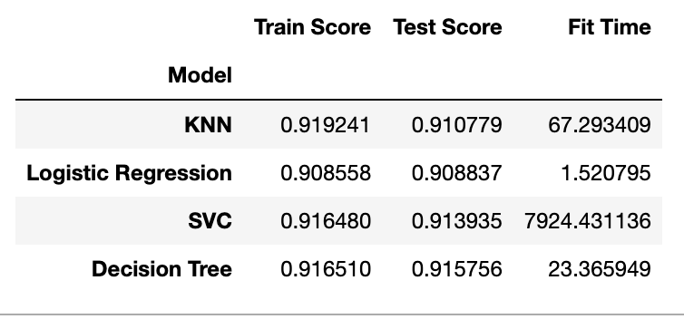

# Comparing Classifiers

#### Overview
In this practical application, your goal is to compare the performance of the classifiers we encountered in this section, namely K Nearest Neighbor, Logistic Regression, Decision Trees, and Support Vector Machines. We will utilize a dataset related to marketing bank products over the telephone

### Data:
The data can be found in: 

[bank-marketing.csv](https://archive.ics.uci.edu/dataset/222/bank+marketing)

Notebook Link
The following notebook contains all the development of the analysis carried out.

[prompt_III.ipynb](https://github.com/oscardominguez17/classification/tree/main/prompt_III.ipynb)

###  Understanding the Data

A dataset of 41187 records has been provided, the dataset collected is related to 17 campaigns that occurred between May 2008 and November 2010.

### Read in the Data
Using pandas to read the information, it looks this way.

| age | job        | marital | education   | default | housing | loan | contact   | month | day_of_week | ... | campaign | pdays | previous | poutcome   | emp.var.rate | cons.price.idx | cons.conf.idx | euribor3m | nr.employed | y  |
|-----|------------|---------|-------------|---------|---------|------|-----------|-------|-------------|-----|----------|-------|----------|------------|--------------|----------------|---------------|-----------|-------------|----|
| 56  | housemaid  | married | basic.4y    | no      | no      | no   | telephone | may   | mon         | ... | 1        | 999   | 0        | nonexistent | 1.1          | 93.994         | -36.4         | 4.857     | 5191.0      | no |
| 57  | services   | married | high.school | unknown | no      | no   | telephone | may   | mon         | ... | 1        | 999   | 0        | nonexistent | 1.1          | 93.994         | -36.4         | 4.857     | 5191.0      | no |
| 37  | services   | married | high.school | no      | yes     | no   | telephone | may   | mon         | ... | 1        | 999   | 0        | nonexistent | 1.1          | 93.994         | -36.4         | 4.857     | 5191.0      | no |
| 40  | admin.     | married | basic.6y    | no      | no      | no   | telephone | may   | mon         | ... | 1        | 999   | 0        | nonexistent | 1.1          | 93.994         | -36.4         | 4.857     | 5191.0      | no |
| 56  | services   | married | high.school | no      | no      | yes  | telephone | may   | mon         | ... | 1        | 999   | 0        | nonexistent | 1.1          | 93.994         | -36.4         | 4.857     | 5191.0      | no |


#### Understanding the Features:

- **Bank data:**<br/>
  **1. age** (numeric) <br/>
  **2. job**: type of job (categorical: 'admin.','blue-collar','entrepreneur','housemaid','management','retired','self-employed','services','student','technician','unemployed','unknown') <br/>
  **3. marital**: marital status (categorical: 'divorced','married','single','unknown'; note: 'divorced' means divorced or widowed) <br/>
  **4. education**: (categorical: 'basic.4y','basic.6y','basic.9y','high.school','illiterate','professional.course','university.degree','unknown') <br/>
  **5. default**: has credit in default? (categorical: 'no','yes','unknown') <br/>
  **6. housing**: has housing loan? (categorical: 'no','yes','unknown') <br/>
  **7.l oan**: has personal loan? (categorical: 'no','yes','unknown') <br/>
  
- **Related with the last contact of the current campaign:**<br/>
  **8. contact**: contact communication type (categorical: 'cellular','telephone') <br/>
  **9. month**: last contact month of year (categorical: 'jan', 'feb', 'mar', ..., 'nov', 'dec') <br/>
  **10.day_of_week**: last contact day of the week (categorical: 'mon','tue','wed','thu','fri') <br/>
  **11. duration**: last contact duration, in seconds (numeric). Important note: this attribute highly affects the output target (e.g., if duration=0 then y='no'). Yet, the duration is not known before a call is performed. Also, after
  the end of the call y is obviously known. Thus, this input should only be included for benchmark purposes and should be discarded if the intention is to have a realistic predictive model. <br/>
  
- **Other attributes:**<br/>
  **12. campaign**: number of contacts performed during this campaign and for this client (numeric, includes last contact) <br/>
  **13. pdays**: number of days that passed by after the client was last contacted from a previous campaign (numeric; 999 means client was not previously contacted) <br/>
  **14. previous**: number of contacts performed before this campaign and for this client (numeric) <br/>
  **15. poutcome**: outcome of the previous marketing campaign (categorical: 'failure','nonexistent','success') <br/>
  
- **Social and economic context attributes:**<br/>
  **16. emp.var.rate**: employment variation rate - quarterly indicator (numeric) <br/>
  **17. cons.price.idx**: consumer price index - monthly indicator (numeric) <br/>
  **18. cons.conf.idx**: consumer confidence index - monthly indicator (numeric) <br/>
  **19. euribor3m**: euribor 3 month rate - daily indicator (numeric) <br/>
  **20. nr.employed**: number of employees - quarterly indicator (numeric) <br/>
  
- **Output variable (desired target):**<br/>
- **21. y**: has the client subscribed a term deposit? (binary: 'yes','no') <br/>

##### Analysis

Analyzing our target variable "Success" we realize that, this is a imbalanced data set, since our target variable has Success = "yes" only in 8% of the total information.


This is the success by month, comparado con la informacion total as we can see success is most likely to occur in the last month of each trimester (March, June, September and December)


##### Conclusions first analysis
- We can discard durations equals to 0
- In the columns housing, loan and default the "unknown" option could be replace with the most popular option before encoder it
- The objective value "y" could be changed to numerical "yes" = 1 and "no" = 0
- Recognition of the categorical features nominal and ordinal was made
- Data has no missing values.
- We have an imbalanced data set

### Train/Test Split

Next, I split the data into train and test set.

```
X_train, X_test, y_train, y_test = train_test_split(X, y, test_size = 0.2, random_state=42) 
```

###  A Baseline Model

What is the baseline performance that our classifier should aim to beat?

- The accuracy of the dummy classifier for train is 88.76%
= The accuracy of the dummy classifier for test is 88.65%

###  A Simple Model
After that we create our first classifier model, this is a LogisticRegression classifier which will train the X_train data and see if the performance is better than the baseline performance, we will run it with all our features and using the default parameters for the model.

### Score the Model

What is the accuracy of your model?

- Accuracy score for the logistic regressor for train is 90.96%
- Accuracy score for the logistic regressor for test is 90.87%

Using the acuracy_score function we can see that the score we get is better than our baseline model.

### Model Comparisons

Using the default parameters, we ran all the classifiers models that we have seen and this are the results:



- SVC is the classifier model that took the longest to train the data and the fastest model was KNN
- The model with the highest accuracy on the test data was LogisticRegression
- All models obtained greater precision than the reference model.

### Improving the model
  
Now that we have some basic models on the board, we try to improve them. Following the next steps:

#### More feature engineering and exploration. For example, should we keep the gender feature? Why or why not?

To identify the influence of each feature linearly on the result, we make a plot of the correlations.


Here we can identify that there are some features that are highly correlated with the resulting variable such as: ['duration', 'pdays', 'previous', 'emp.var.rate', 'euribor3m', 'nr.employed', 'poutcome'] so I decided to work with these features.


#### Hyperparameter tuning and grid search

For this test I will use the params that I got as the most correlated with the target feature. I ran the model using GridSearchCV with their repective hyperparamerers for each model and using cross validation to get the best estimator. The next picture is showing the performance



The results show that the best test score was obtained by the Decision Tree model and the worst test score was obtained by LogisticRegression, but it is still good, it is above 90%.

The SVC model had a very low performance in terms of time, since it took more than 2 hours to train the model, this is a big difference compared to the rest of the models.

#### Adjust your performance metric

In this Step my Objective was to add new scores to the table and also visualize the Confusion Matrix for each model to get a better understanding. For instance the following plot shows the Confusion Matrix for KNN.


I also added the following scores, Precision, Recall and F1 since the scores we were dealing with until now were precision scores.


The results show us that Decision Tree obtained the best results in all metrics and also a reasonable training time. For this reason we can conclude that it is the best model in this case.


### Findings

cual fue el mejor

### Classifier comparison
For the Classifier Comparison, we ran the classifiers in two ways: 
- Simple model execution using the dataset's bank client data features(columns 1 to 7) only and simple models with default parameters.
- Improved models with almost all the features excepting those removed after analysing the correlation matrix.
 
### Simple data and model
We used the basic data (features 1 to 7) and run the classification model with the defalt parameters and see the accuracy score behaves.<br/>
1. The correlation matrix of the 7 features:
   

   <br/>
   
   

3. Simple model performance metrics(Time and Accuracy score) <br/>
 <br/>

The above results of this basic dataset(first 7 features ) and basic models show us:
- All models got results
- In terms of Training time the Logisitic Regression is the best.
- In terms of Test Accuracy the Logisitic Regression is the best along with the SVM, but this one took more training time.


### Improving data and model
In this stage we used more feature and run the classification model with more paramerers and performance metrics.
1. The correlation matrix of the all features:<br/>
   
   <br/>
   - There are several characteristics with a high correlation between them ('emp.var.rate', 'cons.price.idx', 'nr.employed'), these will removed to get the final dataframe   
  
2. After removing the features mentioned above, we ran the model with their repective hyperparamerers using cross validation to get the best estimator. Next is the performance metrics. <br/>
   
   <br/>
   <br/>
   **Improved Model Metrics Comparison** <br/>
   
   <br/>
   -  The results show us Decision Tree got the best Recall and F1 score which are aligned to the objective to correctly identify the most of the subscribers (minimizing false negatives).
   -  Despite the Decision Tree took a considerable execution time compared to the others, we considered it is the best choice for this kind of task, however we need continue improving it to get best times and efficiency.   

3. Feature review by Permutation importances:
   <br/>
   
   <br/>
 

### Findings
1. During this practical application we applied two approaches: one is the basic, with fewer features(bank client data) and simple models, this gave us an initial idea of the data behavior vs the target feature. Then we included more features, after a data correlation analysis we could discard some of them and by the dataset's documentation we removed others which did not make sense to have them in the analysis. This process was valuable because we were getting important insights about the data and about the objetive of the project.
2. By Using different Classification algorithms (KNN, Logistic Regression, Decision Tree and SVM) and comparing their performance results we got the best one for this particular dataset is Decision Tree, it got the best Recall and F1 score which are aligned to the objective to correctly identify the most of the subscribers (minimizing false negatives).  
3. The execution time and training time are factors which could impact on the decision to choose a Classification algorithm but we need to find a balance between those times and the scores we could get from the differents models. CRISP-DM allows to iteratively improve our data and the parameters to get the best performances.
4. Identify the most important features is a key part in the understanding of the prediction, by analysing their data distribution and relation to the target feature (subscribed) we could determine why the customer took the decision to accept the bank term deposit, for example:
   - Euribor3m (Euribor 3 month rate - daily indicator)
   - Month (Last contact month of year)
   - Pdays (Number of days that passed by after the client was last contacted from a previous campaign)

### Next Steps and Recomendations
1. Improve the Classification process by adding tools to handle the imbalanced dataset, as we can see, this dataset is imbalanced which yields some metrics can be misleading between them. One improvement we could do in this process the Resampling Techniques:
   - Oversampling: Duplicate samples from the minority class to increase its representation.
   - Undersampling: Remove samples from the majority class to balance the dataset.
   - SMOTE (Synthetic Minority Oversampling Technique): Generates synthetic data points for the minority class.

2. Analyse the other features, for the scope of this project, we reviewed the top 3 features, the others need to be analyzed to get more valuable information. With this information the marketing campaigns can be improved by focusing on the key aspects which drive the customers' decisions.

### References
- The dataset comes from UCI Machine Learning repository [link](https://archive.ics.uci.edu/ml/datasets/bank+marketing).  The data is from a Portugese banking institution and is a collection of the results of multiple marketing campaigns